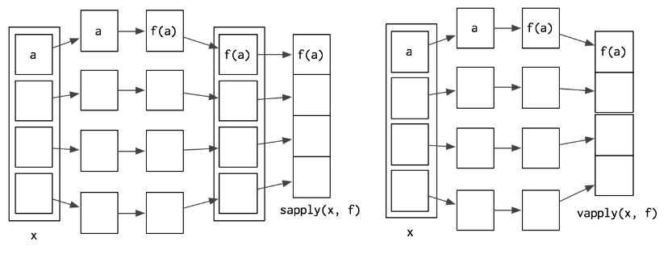
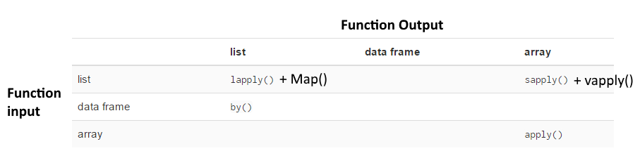

This is a simplified lesson. In the interest of time, some sections were omitted - please refer to textbook for a full lesson!  
http://adv-r.had.co.nz/Functionals.html

# What is a  functional?
A function that takes a function as input and returns a vector. 

## Simple example: randomise
We can get  10 random probabilities using runif:
```{r}
runif(10) # gives us 10 random probabilities (ranging from 0 to 1)
```   

Say we want to call various functions on 10 random probabilities - with fresh probabilities every time.  
This rules out assigning runif(10) to a variable.  
We can hardcode it to each function:
```{r, eval=FALSE}
max(runif(10))
mean(runif(10))
```   

Or we can make a functional that accepts any compatible function:
```{r, eval=FALSE}
randomise <- function(f) f(runif(10)) # calls our function on runif(10)

randomise(mean)
randomise(max)
randomise(min)
```   

***

# Use functionals for cleaner code
+ Used for functional programming
+ Often used as an alternative to for loops
+ For loops don't explicitly express their goal
+ Functionals are much clearer

**"The key to using functionals in place of for loops is recognising that common looping patterns are already implemented in existing base functionals." - Wickham**    
So, let's go through some.

***

# Useful functional: Lapply
Takes a list and a function, applies the function to each element in the list, and returns it as a modified list.  

Question: if this returns a list, but functionals return 'vectors', how is this a functional?  
Answer: Vectors include atomic vectors (all elements have same type) and lists, aka generic vectors (potentially containing different element types)

  
Sidenote: each modification on each element is isolated, so computation order does not matter.   
Thus, the computations can be done in parallel (dispatched to different cores and then computed in parallel).   
Note that this is only faster when the computations take longer than sending the computations to different cores.    See textbook for more info.

## An R implementation of lapply:
```{r}
lapply2 <- function(x, f, ...) {
  out <- vector("list", length(x)) # create an empty vector with length of list
  for (i in seq_along(x)) {        # seq_along gives indices of list
    out[[i]] <- f(x[[i]], ...)     # apply the function to the element, then put it in the vector
                                   # note the '...' lets us supply additional args to f
  }
  out
}
```   

## Basic use of lapply
``` {r}
myList <- list("apple", "banana", c("grapes", "plums"))
myList
```

Say we want to paste ".txt" to each element of the list.
There's a messy way:
```{r}
out <- vector("list", length(myList)) # create an empty vector with length of myList
for (fruit in seq_along(myList)) {        
    out[[fruit]] <- paste(myList[[fruit]], ".txt", sep="")}# apply the function to the element, then put it in the vector
out
```

And the cleaner, lapply way:
```{r}
lapply(myList, paste, ".txt", sep = "")   
```

In essence, lapply is calling this function for each element in myList:  
paste('element in myList', ".txt", sep="")

## Using lapply with anonymous functions
We can use another syntax to use anonymous functions.
```{r}
lapply(myList, function(fruit) {if(any(fruit=='apple')) paste("red",fruit) else fruit})
```
In the above example, our anonymous function, being an unnamed function, is
'function(fruit) {if(any(fruit=='apple')) paste("red",fruit) else fruit}'.  

## Varying second/third/... arguments

The previous syntax also lets you pass elements as second/third/other arguments to a function.  
For example, if I want to paste each element (fruit) after "Green":
```{r}
lapply(myList, function(fruit) paste("Green", fruit))
```

For another example, consider the default method of mean:
```{r}
x <- c(1:4, 10) # vector of five elements: 1, 2, 3, 4, 10

mean(x, trim = 0)
``` 

We can vary the values of trim using Lapply:
```{r}
trims <- c(0, 0.2, 0.35)
lapply(trims, function(trim) mean(x, trim = trim))
``` 
This is equivalent to calling mean on x with each value in the trims vector, and then joining the results in a list.  

## Aside: understanding trim
The trim argument specifies what percentage of observations are deleted from each end before computing the mean.
```{r}
x <- c(1:4, 10) # vector of five elements: 1, 2, 3, 4, 10
mean(x, trim=0) # output is 4; this is the default trim

mean(x, trim=0.2) # trim 20% off ends; 20% of 5 elements is 1 element; trims 1 element from each end; output is 3
mean(2:4) #equivalent to above
```

Note that the number of elements trimmed off the ends always rounds down:
```{r}
mean(x, trim=0.35)# trim 35% off ends; 35% of 5 elements is 1.75 elements; trims one element from each end; output is 3
```

## Exercise 1: lapply 
Why are the following two invocations of lapply() equivalent?

```{r, eval=FALSE}
trims <- c(0, 0.1, 0.2, 0.5)
x <- rcauchy(100)

lapply(trims, function(trim) mean(x, trim = trim))
lapply(trims, mean, x = x)
```

## Why lapply is useful
+ more concise than writing a loop
+ accepts dataframe as input, applies function to each column
(since a dataframe is a list of columns)

```{r}
# Example of dataframe use:
mtcars

# whats the mean of each column?
meanMtcars <- lapply(mtcars, mean) # equivalent to lapply(mtcars, function(x) mean(x))
meanMtcars

# divide each value by mean of its column:
mtcarsModified <- mtcars
mtcarsModified[] <- lapply(mtcars, function(x) x/mean(x)) # remember you can divide vectors in R, so every value in a column will be divided by that column's mean.
head(mtcarsModified[])
```

## Exercise 2: Lapply on dataframes

The function below scales a vector so it falls in the range [0, 1]. How would you apply it to every column of scaleData? 

```{r}
scale01 <- function(x) {
  rng <- range(x, na.rm = TRUE)
  (x - rng[1]) / (rng[2] - rng[1])
}

# make a dataframe:
scaleData <- data.frame(A=c(1,3,5), B=c(2,4,6), C=c(1,NA,5), row.names=c("row1", "row2", "row3"))
scaleData
``` 
How would you apply it to numeric columns of scaleData2? (Keeping non-numeric columns in output).  
Hint: very similar to first example of using lapply with a custom function.
```{r}
# apply to only numeric columns - first add a non-numeric column
scaleData2 <- scaleData
scaleData2[,"D"] <- c("im", "not", "numeric")
scaleData2
``` 

***

# Sapply and Vapply
Like lapply - both take a list and function as input.  
BUT, they return an atomic vector (instead of a list).
Recall: atomic vector only contains values of the same type, while a list can contain values of different types.

The difference between Sapply and Vapply:  
Sapply will 'guess' to simplify its output from a list to an atomic vector.  
Vapply takes an additional argument specifying the output type. Probably safer to use - won't fail silently.  
  


## Example where sapply and vapply agree:  
``` {r}
sapply(mtcars, is.numeric) # will guess that the output type is 'logical'.
vapply(mtcars, is.numeric, logical(1)) # explicitly state that output types is 'logical'.
```

## Example where they differ:  
``` {r}
sapply(list(), is.numeric)
vapply(list(), is.numeric, logical(1))
```

## Example where using sapply is dangerous: extracting class of columns where you falsely assume that class is one value, when the class of a column has two values. May cause errors downstream.
``` {r, error=TRUE}
class(Sys.time()) # note: class(Sys.time()) has two values:
# POSIXct (# of seconds since 'the epoch') and POSIXt (text format)

df2 <- data.frame(x = 1:10, y = Sys.time())
df2

sapply(df2, class) # guesses something that contradicts our assumption - class has 2 values
vapply(df2, class, character(1)) # tells us something is wrong (we assumed one value per class, but this is false)
```

***

# Map (very similar to mapply)
For the previous functionals, we could only vary one argument to the function.
The function 'Map' lets us vary more arguments.

Motivating example:  
Say we have a list of observations and a seperate list of weighted means.
How do we compute the weighted means?
R has a function called 'weighted.mean', but it does not accept lists.
```{r}
obs <- list(c(1,2,3,4)) # a trivial list containing only one element
weight <- list(c(4,3,2,1))
```

```{r, eval=FALSE}
# Aside: since the lists only contain one element each, we could just pass the f(n) the elements directly:
weighted.mean(c(1,2,3,4), c(4,3,2,1))
# but what we really want to know is how to do this for lists.
```

We can modify our function before passing it to lapply...
```{r}
lapply(seq_along(obs), function(i) {  
  weighted.mean(obs[[i]], weight[[i]])
})
```

Or just use map, which is much cleaner.
```{r}
Map(weighted.mean, obs, weight)
```

Another example: Standardize columns by computing the means and then divide by them.
```{r}
mtcarsModified <- mtcars

mtmeans <- lapply(mtcars, mean)
mtcarsModified[] <- Map(`/`, mtcars, mtmeans)
head(mtcarsModified[])
```

In this case, equivalent to our prior function:
```{r}
mtcarsModified[] <- lapply(mtcars, function(x) x / mean(x))
```

Note: Map is basically the same as mapply, except mapply will try to simplify the output to a vector (like sapply) unless explicitly told not to. Mapply's notation for arguments is also inconsistent with other functions (see textbook).  

***

# Manipulating Matrices and Dataframes

There are various base functionals that work on matrices and dataframes.
The textbook describes apply(), sweep(), and outer() for matrices/dataframes.

I won't go into them, as I generally use the packages plyr and dplyr for these manipulations.  
The functions from these packages are more intuitive to use and can do more things.  

For example, these are the main things that base R functionals can do (for matrices + dataframes):
  

And here's what plyr can do:


***   

# Manipulating Lists
Textbook describes:

Reduce(f, x) -  reduces vector x by recursively calling function f.
Example:
```{r}
Reduce(`+`, 1:3) # -> ((1 + 2) + 3)
```

Filter(f, x) - selects only elements of x that match boolean function f.  
Works on dataframes.  
Example:
```{r}
Filter(is.integer, list(1:3, "no"))
```

Find(f, x) - returns first element of x that matches boolean function f

Position(f, x) - returns position of first element of x that matches boolean function f

***

# Loops that should be left as is
+ Modifying in place
+ Recursive functions
+ While loops

***

# Closing remarks
+ You've probably used a functional without realizing it. 
+ You can write your own functionals to avoid repeating code. The textbook details an example in 'rolling computations'.
+ There are also details on mathetical functionals in the textbook.

***

# Answers to selected exercises from textbook
  
## Exercise 1: lapply  
Why are these invocations of lapply equivalent?
```{r, eval=FALSE}
trims <- c(0, 0.1, 0.2, 0.5)
x <- rcauchy(100)
lapply(trims, function(trim) mean(x, trim = trim))
lapply(trims, mean, x = x)
```

The first invocation explicitly states that the second argument of mean should be a trim element, while the first argument is just our vector x.  

The second invocation explicitly states that the mean function should compute the mean of x, and thus it assumes we vary trim, which is the next argument in the default method of mean.  

I.e. the default S3 method of mean is:  
mean(x, trim = 0, na.rm = FALSE, ...)  

In essence, the second invocation is calling:  
mean(x=x, 'AN ELEMENT OF TRIMS') #pseudocode, do not run

Whereas the first invocation is calling:  
mean(x, trim='AN ELEMENT OF TRIMS') #pseudocode, do not run

Aside: Both of these approaches are using 'positional mapping' for arguments that are not explicitly assigned with an '='.

## Exercise 2: Lapply dataframes
```{r}
# apply to every column
data.frame(lapply(scaleData, scale01))

# apply to numeric columns
data.frame(lapply(scaleData2, function(x) if(is.numeric(x)) scale01(x) else x))
``` 

## Some solutions here that I consulted:
https://bookdown.org/Tazinho/Advanced-R-Solutions/functionals.html